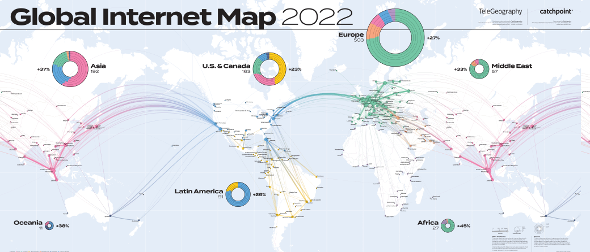
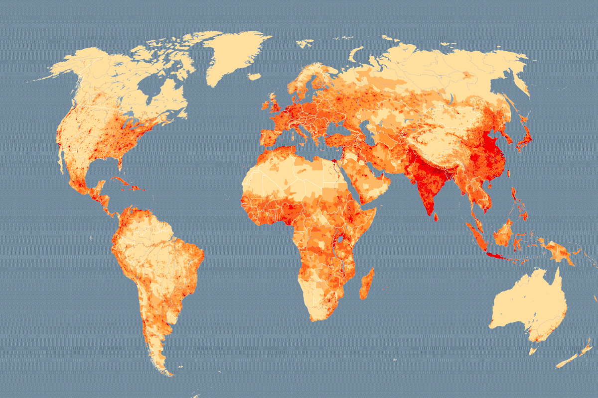
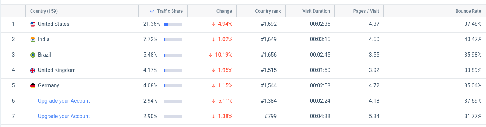
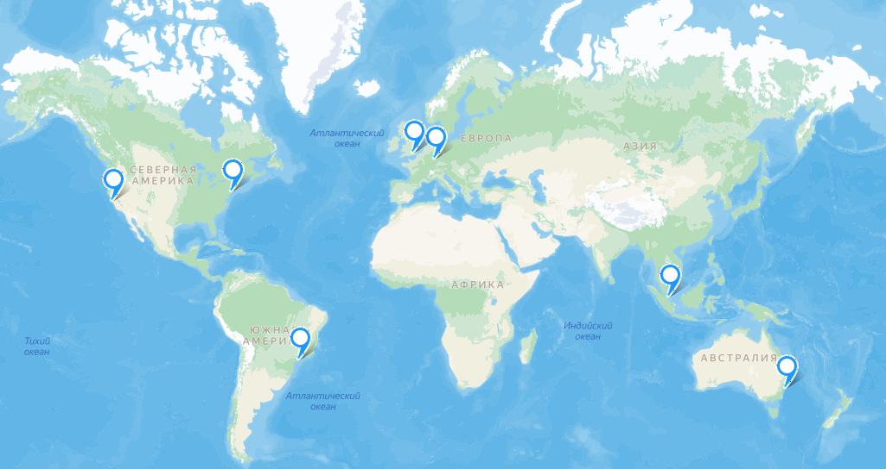
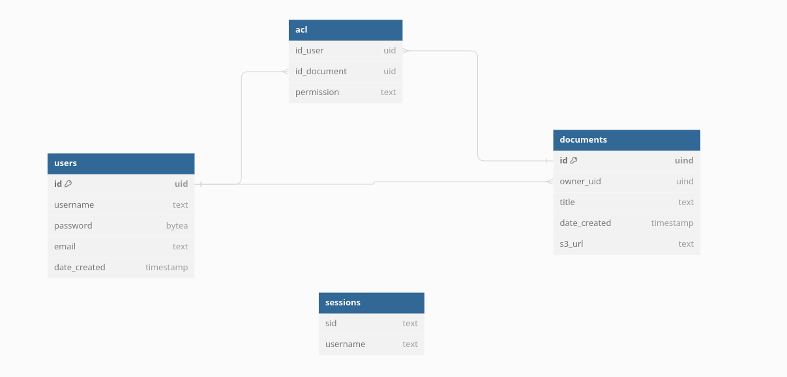
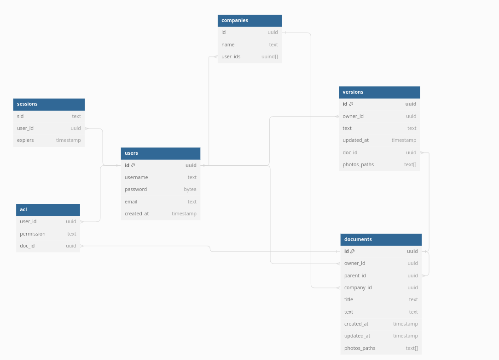

# Проектирование высоконагруженного пространства для командной работы

Курсовая работа в рамках 3-го семестра программы по Веб-разработке ОЦ VK x МГТУ им. Н.Э. Баумана (ex. "Технопарк") по дисциплине "Проектирование высоконагруженных сервисов"

#### Автор - [Андрей Мышляев](https://park.vk.company/profile/a.myshliaev/ "Страница на портале VK x МГТУ")
#### Задание - [Методические указания](https://github.com/init/highload/blob/main/homework_architecture.md)

#### Содержание:
1. [Тема, функционал и аудитория](#1)
2. [Расчет нагрузки](#2)
3. [Расчет глобальной нагрузки](#3)
4. [Расчет локальной нагрузки](#4)
5. [Логическая схема БД](#5)
6. [Физическая схема БД](#6)
7. [Технологии](#7)

## Часть 1. Тема и целевая аудитория <a name="1"></a>

### Тема курсовой работы - **"Проектирование сервиса для командной работы"**
Confluence — это удобное рабочее пространство для удаленных команд, в котором участники могут хранить знания и сотрудничать друг с другом. В приложении Confluence Cloud можно легко записывать возникшие идеи, создавать и редактировать страницы и совместно работать с командой практически на любом устройстве.


### Ключевой функционал сервиса
- Поиск и навигация по документам.
- Просмотр документов.
- Создание и редактирование документов.

### Целевая аудитория
- Весь мир
- 25 млн пользователей в месяц (MAU) [^1]
- 0.84 млн пользователей в день (DAU) [^1]

## Часть 2. Расчет нагрузки <a name="2"></a>

### Продуктовые метрики

### Среднее количество действий пользователя по типам в день.
Допустим, в день пользователь совершает 10 посещений. Таким образом при ежедневном посещении 0.84 млн пользователей количество просмотров страниц будет равно 0.84 * 10 = 8.4 млн. На основе личного опыта предположим, что около 1 страницы пользователь находит по поиску, а навигация по сайту 10 - 1 = 9.
Тогда получается, что на поиск уходит 0.84 млн просмотров страниц, а на переход по ссылкам и навигацию внутри сайта уходит 7.56 млн просмотров.

#### Создание и редактирование страниц.
Допустим, в день пользователь делает 2 вправки. Тогда при ежедневном посещении 0.84 млн пользователей количество вправок будет равно:
```
0.84 * 2 = 1.68 млн.
```
Допустим, что количество созданий документов равняется 5% от числа вправок. Тогда новых документов в день равняется:
```
1.68 * 0.05 = 0.084 млн.
```

| Действие пользователя  | Количество в день |
|------------------------|-------------------|
| Поиск                  | 840 000           |
| Навигация              | 7 560 000         |
| Просмотр документов    | 8 400 000         |
| Создание документов    | 84 000            |
| Редактирование         | 1 680 000         |

В среднем одна картинка равняется 500 КБ.
В среднем на одного пользователя приходится 2 ГБ за 5 лет. Тогда за один день он занимает новые 1.1 МБ. Откуда получаем объем памяти, затрачиваемой каждый день: 
```
0.84 млн * 1.1 МБ = 924 ГБ.
```
Confluence существует уже 18 лет. Тогда всего памяти было затрачено: 
```
18 * 365 * 924 = 5.78 ПБ. 
```
Найдём общее число документов: 
```
18 * 365 * 84 000 = 551 880 000.
```
Найдём средний вес документа: 
```
5.78 ПБ / 551 880 000 = 11.2 МБ.
```
В среднем на статью приходится [620 слов](https://thequickadvisor.com/how-many-links-does-wikipedia-have/), а средняя длина слов равняется 5 буквам. 1 символ в Unicode кодируется 2 байтами. Статья также имеет ID - 16б (UUID).
В среднем каждая вправка занимает [25 МБ](https://stats.wikimedia.org/#/en.wikipedia.org/content/net-bytes-difference/normal|bar|2-year|~total|daily).

Средний объём памяти текстом:
```
(620 * 5 * 2 + 16) / 8 = 777 байт.
```

#### Сводная таблица продуктовых метрик
| Характеристика                                           |    Метрика    |
|:---------------------------------------------------------|:-------------:|
| MAU                                                      |      25M      |
| DAU                                                      |     0.84М     |
| Общее число документов                                   |   551.88 М    |
| Среднее время просмотра страницы                         |    5.26 м     |
| Средний размер документа                                 |    11.2 МБ    |
| Средний размер вправки документа                         |     25 МБ     |
| Среднее количество действий по просмотру документов      |  8.4 M/сутки  |
| Среднее количество действий по созданию документов       | 0.084 М/сутки |
| Среднее количество действий по редактированию документов | 1.68 М/ сутки |

### Технические метрики:

Найдём среднее число картинок на документ. Из общего среднего веса картинки вычтем вес текста и делим на средний размер картинки.
```
(11.2 МБ - 777 байт) / 500 КБ = (11468 КБ - 0.75 КБ) / 500 КБ = 23
```

Размер хранения текста: 
```
0.77 КБ * 551 880 000 = 0.39 ТБ
```

Размер хранения картинок: 
```
23 * 500 КБ * 551 880 000 = 5.77 ПТ 
```

RPS по просмотру документов: 
```
8 400 000 / (60 * 60 * 24) = 97.2
```

RPS по созданию документов: 
```
84 000 / (60 * 60 * 24) = 0.97
```

RPS по редактированию документов: 
```
1 680 000  / (60 * 60 * 24) = 19.4
```

Возьмем небольшой коэффициент k=1,5 отличия от среднего трафика для получения пикового трафика по просмотру документов: 
```
97.2 * 11.2 МБ * 1.5 = 1.59 ГБ/с
```

Возьмем небольшой коэффициент k=1,5 отличия от среднего трафика для получения пикового трафика по созданию документов: 
```
0.97 * 11.2 МБ * 1.5 = 0.016 ГБ/с
```

Возьмем небольшой коэффициент k=1,5 отличия от среднего трафика для получения пикового трафика по редактированию документов: 
```
19.4 * 25 МБ * 1.5 = 0.7 ГБ/с
```

Пиковое потребление в течение суток:
```
1.59 + 0.016 + 0.7 = 2.31 ГБ/с
```

Cуммарный суточного трафик: 
```
(97.2 * 11.2 + 0.97 * 11.2 + 19.4 * 25) * (24 * 60 * 60) = 136 901 145 МБ/сутки = 0.127 ПТ/сутки
```

#### Сводная таблица технических метрик
| Характеристика                      |    Метрика     |
|:------------------------------------|:--------------:|
| Размер хранения текста              |    0.39 ТБ     |
| Размер хранения картинок            |    5.77 ПТ     |
| Пиковое потребление в течении суток |  12.31 ГБ/сек  |
| Суммарный суточный                  | 0.127 ПТ/сутки |
| RPS по просмотру документов         |      97.2      |
| RPS по созданию документов          |      0.97      |
| RPS по редактированию документов    |      19.4      |


## Часть 3. Расчет глобальной нагрузки <a name="3"></a>

### Глобальная карта сетевых магистралей. 


### Карта плотности населения.


### Распределение пользователей по странам.


### Расстановка серверов компании atlassian.


Расположение ДЦ
Основная аудитория находится в Северной и Южной Америке, Европе и Азии.
Расположим ДЦ в соответствии с географическим положением.

Тогда:

1. Расположим ДЦ в Нью-Йорке и Сан-Франциско (крупнейшие центры трафика с восточного и западного побережья).

2. Сан-Паулу (крупнейший город и центр трафика Бразилии).

3. Франкфурт (одна из крупнейших развязок в Европе и мире).

4. Лондон (крупнейший узел Великобритании).

5. Сингап (столица Сингапура, отвечает за Индию, юг Азии и Океанию).

6. Сидней (крупнейший узел в Австралии).

### Выбор способа глобальной балансировки

Для балансировки клиентов между регионами (Америка, Европа, Азия) будем подключать пользователя по домену 3го уровня в url запроса. То есть в случае australia.atlassian.net подключение произойдёт к Австралии.

Для уменьшения задержки в пределах региона будем использовать BGP Anycast для выбора нужного ЦОД'а. 
В США будет использоваться один IP для AS, который будет сопоставлять с IP настоящего ЦОД'а. 
Например, в случае США(самого нагруженного региона) разобьем все линки BGP сети условно на 2 группы, каждая из которых будет соответствовать одному из двух ЦОД'ов. При загруженности (или при полном отказе одного из ЦОД'ов) мы можем скорректировать BGP веса для снижения нагрузки на ЦОД.

## Часть 4. Расчет локальной нагрузки <a name="4"></a>
Балансировка будет осуществляться на L3 и L7 уровнях

### L3 Балансировка
Балансировка на этом уровне будет производится по схеме Virtual Server via IP Tunneling

Для обеспечаения отказоустойчивости системы стоит использовать фреймфорк Keepalived, реализующий балансировку нагрузки, мониторинг работы серверов.

Кроме того Keepalived подерживает Virtual Router Redundancy Protocol (VRRP), который и предоставляет возможность отслеживать состояние узлов системы, а при отказе одного из них перенаправить трафик на другой узел.

### L7 балансировка

Будем использовать сервер Nginx. Использовать его будем для следующих процессов:

* Отдача статики 
* Сжатие контента (gzip)
* Обеспечение перезапуска сервиса без остановки обслуживания 
* Отслеживание обработки медленных клиентов (с помощью использования асинхронной обработки)

Шифрования будет производиться с помощью Let`s Encrypt

Для улучшения производительности и ускорения подключения будем использовать Session Cache.

## Часть 5. Логическая схема БД <a name="5"></a>.

[Ссылка на логическую БД](https://dbdiagram.io/d/6613c87903593b6b6174a935)


Далее опишем назначение каждой из таблицы.

| Таблица       |                     Описание                      |
|:--------------|:-------------------------------------------------:|
| users         |          хранения данных о пользователе           |
| documents     |            хранения данных о документе            |
| perm_document | хранения данных о правах пользователя и документа |
| sessions      |         хранение куки пользователя в кэше         |

### Размеры данных
#### Таблица пользователей

* uid - id пользователя ( 16 B )
* username - имя пользователя ( 60 B )
* email - email пользователя ( 60 B )
* password- хеш пароля ( 32 B )
* created - дата создания аккаунта ( 4 B )

#### Таблица Сессий

* cookie - кука с которой пользователй залогинен ( 32 B )
* expiers - дата истечения действия куки ( 4 B )
* uid_user - пользователь, который зашел с такой кукой ( 16 B )

#### Таблица документов

* uid ( 16 B )
* owner_uid - владелец документа ( 16 B )
* title - имя документа ( 60 B )
* created - дата создания ( 4 B )
* s3_url - s3 ссылка на последнюю версию ( 256 B )

#### Таблица прав доступа
* uid_user - айди пользователя  ( 16 B )
* uid_document - document к которому дается доступ ( 16 B )
* perm - право использования ( 16 B )


### Нагрузки на чтение/запись

Куки пользователей хранятся 30 дней, ежемесячный трафик 25 млн человек. Найдем количество чтений таблицы пользователей. RPS авторизаций будет равен:
```
25 000 000 / ( 30 * 24 * 60 * 60 ) = 9.7 RPS 
```

Допустим, что 5% от авторизаций это регистрации, тогда запись таблицы пользователей равняется:
```
9.7 * 0.05 = 0.5 RPS
```

Из 3 главы мы выяснили, что чтение документов занимает RPS 97.2.

Создание и редактирование документов составляет 0.97 + 19.4 = 22.4 RPS.

Хранение кук. Проверка на авторизацию происходит при каждом просмотре, создании и редактировании документа. Таким образом найдём RPS чтения:
```
97.2 + 22.4 = 119.6 RPS
```

Запись кук будет происходить после каждой авторизации и будет равняться 9.7 RPS.

Хранение данных о правах. Чтение будет происходить после каждого просмотра, создания и редактирования документа. Таким образом наше RPS чтения равняется 119.6.

Запись будет происходить после каждого создания документа. Допустим, в среднем в компании 30 человек, тогда найдём RPS записи:
```
30 * 0.97 = 29.1 RPS.
```

| Таблица                      | Чтение |  Запись  |
|:-----------------------------|:------:|:--------:|
| users                        |  9.7   |   0.5    |
| documents                    |  97.2  |   22.4   |
| perm_document                | 119.6  |   9.7    |
| sessions                     | 119.6  |   9.7    |

## Часть 6. Физическая схема БД <a name="6"></a>.
### Схема с привязкой к конкретным БД

Ниже представлена схема со списком таблиц, полей и связей между ними с привязкой к конкретным базам.



### Репликация PostgreSQL
В каждом ДЦ будет стоять по 2 node, в каждой из них будет поднята БД, одна из них будет master, друга репликой. Обе ноды будут обращаться в одну БД, пока та не станет доступной.

### Шардинг
Из-за небольшой нагрузки на каждый из ДЦ шардинг будет отсутствовать.

### Индексы
В таблице users необходимо сделать поле username индексом, потому что часто будет проверка прав пользования документом конкретным пользователем.

### Часть 7. Технологии <a name="7"></a>.

|Технология | Необходимость использования |
|:----------|:---------------------------:|
| WebSocket | Поддержка совместной работы |
| Nginx     |        Одача статики        |
| Ingress-controller |    Балансировка по нодам    |
| Kubernetes | Автоматизация развертывания |
| Redis     |        Работа с куки        |
| gRPS      |  Обращение к микросервисам  |
| Golang    |    Язык для web-сервисов    |
| PostgreSQL |       Хранение данных       |
| S3        |     Хранение документов     |

## Список литературы.

1. [Карта ДЦ www.atlassian.com](https://www.atlassian.com/trust/reliability/infrastructure)
2. [Глобальная карта сетевых магистралей](https://global-internet-map-2022.telegeography.com/)
3. [Распределение пользователей по странам.](https://pro.similarweb.com/#/digitalsuite/websiteanalysis/audience-geography/*/999/3m?key=atlassian.com&webSource=Total)
