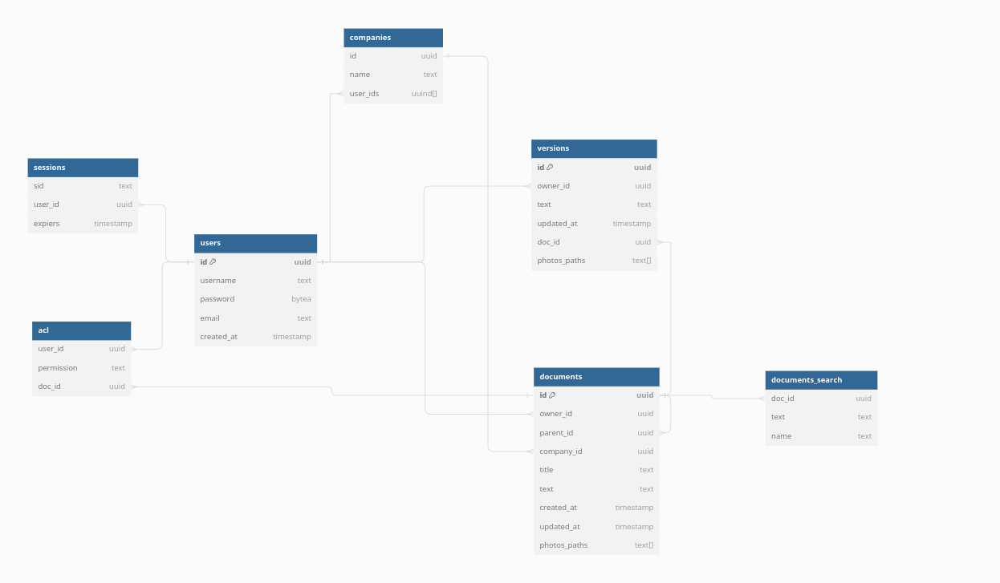

# Проектирование высоконагруженного пространства для командной работы

Курсовая работа в рамках 3-го семестра программы по Веб-разработке ОЦ VK x МГТУ им. Н.Э. Баумана (ex. "Технопарк") по дисциплине "Проектирование высоконагруженных сервисов"

#### Автор - [Андрей Мышляев](https://park.vk.company/profile/a.myshliaev/ "Страница на портале VK x МГТУ")
#### Задание - [Методические указания](https://github.com/init/highload/blob/main/homework_architecture.md)

#### Содержание:
1. [Тема, функционал и аудитория](#1)
2. [Расчет нагрузки](#2)
3. [Расчет глобальной нагрузки](#3)
4. [Расчет локальной нагрузки](#4)

## Часть 1. Тема и целевая аудитория <a name="1"></a>

### Тема курсовой работы - **"Проектирование сервиса для командной работы"**
Confluence — это удобное рабочее пространство для удаленных команд, в котором участники могут хранить знания и сотрудничать друг с другом. В приложении Confluence Cloud можно легко записывать возникшие идеи, создавать и редактировать страницы и совместно работать с командой практически на любом устройстве.


### Ключевой функционал сервиса
- Поиск и навигация по документам.
- Просмотр документов.
- Создание и редактирование документов.

### Целевая аудитория
- Весь мир
- 25 млн пользователей в месяц (MAU) [^1]
- 0.84 млн пользователей в день (DAU) [^1]

## Часть 2. Расчет нагрузки <a name="2"></a>

### Продуктовые метрики

### Среднее количество действий пользователя по типам в день.
Допустим, в день пользователь совершает 10 посещений. Таким образом при ежедневном посещении 0.84 млн пользователей количество просмотров страниц будет равно 0.84 * 10 = 8.4 млн. На основе личного опыта предположим, что около 1 страницы пользователь находит по поиску, а навигация по сайту 10 - 1 = 9.
Тогда получается, что на поиск уходит 0.84 млн просмотров страниц, а на переход по ссылкам и навигацию внутри сайта уходит 7.56 млн просмотров.

#### Создание и редактирование страниц.
Допустим, в день пользователь делает 2 вправки. Тогда при ежедневном посещении 0.84 млн пользователей количество вправок будет равно:
```
0.84 * 2 = 1.68 млн.
```
Допустим, что количество созданий документов равняется 5% от числа вправок. Тогда новых документов в день равняется:
```
1.68 * 0.05 = 0.084 млн.
```

| Действие пользователя  | Количество в день |
|------------------------|-------------------|
| Поиск                  | 840 000           |
| Навигация              | 7 560 000         |
| Просмотр документов    | 8 400 000         |
| Создание документов    | 84 000            |
| Редактирование         | 1 680 000         |

В среднем одна картинка равняется 500 КБ.
В среднем на одного пользователя приходится 2 ГБ за 5 лет. Тогда за один день он занимает новые 1.1 МБ. Откуда получаем объем памяти, затрачиваемой каждый день: 
```
0.84 млн * 1.1 МБ = 924 ГБ.
```
Confluence существует уже 18 лет. Тогда всего памяти было затрачено: 
```
18 * 365 * 924 = 5.78 ПБ. 
```
Найдём общее число документов: 
```
18 * 365 * 84 000 = 551 880 000.
```
Найдём средний вес документа: 
```
5.78 ПБ / 551 880 000 = 11.2 МБ.
```
В среднем на статью приходится [620 слов](https://thequickadvisor.com/how-many-links-does-wikipedia-have/), а средняя длина слов равняется 5 буквам. 1 символ в Unicode кодируется 2 байтами. Статья также имеет ID - 16б (UUID).
В среднем каждая вправка занимает [25 МБ](https://stats.wikimedia.org/#/en.wikipedia.org/content/net-bytes-difference/normal|bar|2-year|~total|daily).

Средний объём памяти текстом:
```
(620 * 5 * 2 + 16) / 8 = 777 байт.
```

#### Сводная таблица продуктовых метрик
| Характеристика                                           |    Метрика    |
|:---------------------------------------------------------|:-------------:|
| MAU                                                      |      25M      |
| DAU                                                      |     0.84М     |
| Общее число документов                                   |   551.88 М    |
| Среднее время просмотра страницы                         |    5.26 м     |
| Средний размер документа                                 |    11.2 МБ    |
| Средний размер вправки документа                         |     25 МБ     |
| Среднее количество действий по просмотру документов      |  8.4 M/сутки  |
| Среднее количество действий по созданию документов       | 0.084 М/сутки |
| Среднее количество действий по редактированию документов | 1.68 М/ сутки |

### Технические метрики:

Найдём среднее число картинок на документ. Из общего среднего веса картинки вычтем вес текста и делим на средний размер картинки.
```
(11.2 МБ - 777 байт) / 500 КБ = (11468 КБ - 0.75 КБ) / 500 КБ = 23
```

Размер хранения текста: 
```
0.77 КБ * 551 880 000 = 0.39 ТБ
```

Размер хранения картинок: 
```
23 * 500 КБ * 551 880 000 = 5.77 ПТ 
```

RPS по просмотру документов: 
```
8 400 000 / (60 * 60 * 24) = 97.2
```

RPS по созданию документов: 
```
84 000 / (60 * 60 * 24) = 0.97
```

RPS по редактированию документов: 
```
1 680 000  / (60 * 60 * 24) = 19.4
```

Возьмем небольшой коэффициент k=1,5 отличия от среднего трафика для получения пикового трафика по просмотру документов: 
```
97.2 * 11.2 МБ * 1.5 = 1.59 ГБ/с
```

Возьмем небольшой коэффициент k=1,5 отличия от среднего трафика для получения пикового трафика по созданию документов: 
```
0.97 * 11.2 МБ * 1.5 = 0.016 ГБ/с
```

Возьмем небольшой коэффициент k=1,5 отличия от среднего трафика для получения пикового трафика по редактированию документов: 
```
19.4 * 25 МБ * 1.5 = 0.7 ГБ/с
```

Пиковое потребление в течение суток:
```
1.59 + 0.016 + 0.7 = 2.31 ГБ/с
```

Cуммарный суточного трафик: 
```
(97.2 * 11.2 + 0.97 * 11.2 + 19.4 * 25) * (24 * 60 * 60) = 136 901 145 МБ/сутки = 0.127 ПТ/сутки
```

#### Сводная таблица технических метрик
| Характеристика                      |    Метрика     |
|:------------------------------------|:--------------:|
| Размер хранения текста              |    0.39 ТБ     |
| Размер хранения картинок            |    5.77 ПТ     |
| Пиковое потребление в течении суток |  12.31 ГБ/сек  |
| Суммарный суточный                  | 0.127 ПТ/сутки |
| RPS по просмотру документов         |      97.2      |
| RPS по созданию документов          |      0.97      |
| RPS по редактированию документов    |      19.4      |


## Часть 3. Расчет глобальной нагрузки <a name="3"></a>

### Глобальная карта сетевых магистралей. 


### Карта плотности населения.


### Распределение пользователей по странам.


### Расстановка серверов компании atlassian.


Расположение ДЦ
Основная аудитория pinterest находится в Северной и Южной Америке, Европе и Азии.
Расположим ДЦ в соответствии с географическим положением.

Тогда:

1. Расположим ДЦ в Нью-Йорке и Сан-Франциско (крупнейшие центры трафика с восточного и западного побережья).

2. Сан-Паулу (крупнейший город и центр трафика Бразилии).

3. Франкфурт (одна из крупнейших развязок в Европе и мире).

4. Лондон (крупнейший узел Великобритании).

5. Сингап (столица Сингапура, отвечает за Индию, юг Азии и Океанию).

6. Сидней (крупнейший узел в Австралии).

### Выбор способа глобальной балансировки

Для балансировки клиентов между регионами (Америка, Европа, Азия) будем использовать Geo Based DNS.

Для уменьшения задержки в пределах регионом будем использовать BGP Anycast для выбора нужного ЦОД'а. 
В США будет использоваться один IP для AS, который будет сопоставлять с IP настоящего ЦОД'а. 
Например, в случае США(самого нагруженного региона) разобьем все линки BGP сети условно на 2 группы, каждая из которых будет соответствовать одному из четырех ЦОД'ов. При загруженности (или при полном отказе одного из ЦОД'ов) мы можем скорректировать BGP веса для снижения нагрузки на ЦОД.

## Часть 4. Расчет локальной нагрузки <a name="4"></a>
Балансировку будем делать посредством роутинга и L7 балансировщиков.

После приземления клиента в цод маршрут выбирается на основании BGP Routing'а поскольку у диска может быть большой входящий трафик стоит использовать сетевое оборудование. Будем использовать хеширование по IP, чтобы пакеты с одного пользователя попадали на один и тот же балансировщик, и  сохранять кеширование SSL сессии. Роутеры будет в паре с одним виртуальным IP, резервируемым с помощью keepalived CARP.

В качестве L7 балансировщика будем использовать nginx, он же будет и отвечать за SSL терминацию. 
Nginx будет находится под kubernetes который будет осуществлять liveness пробы и обновлять конфигурацию балансировщика для быстрого переключение трафика с упавших бекеров. Балансировщики так же будут стоять в паре через keepalive для отказоустойчивости.

## Список литературы.

1. [Карта ДЦ www.atlassian.com](https://www.atlassian.com/trust/reliability/infrastructure)
2. [Глобальная карта сетевых магистралей](https://global-internet-map-2022.telegeography.com/)
3. [Распределение пользователей по странам.](https://pro.similarweb.com/#/digitalsuite/websiteanalysis/audience-geography/*/999/3m?key=atlassian.com&webSource=Total)
